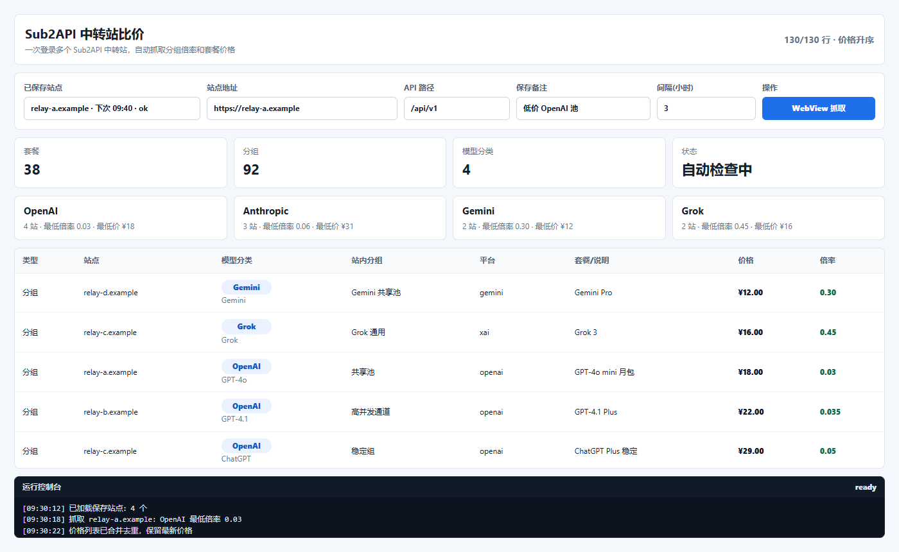
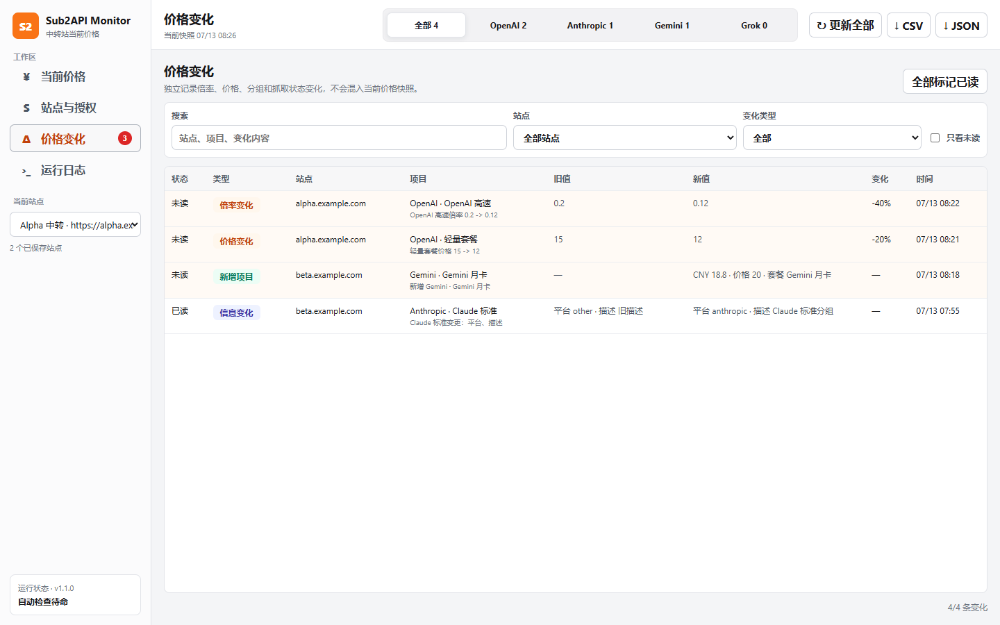
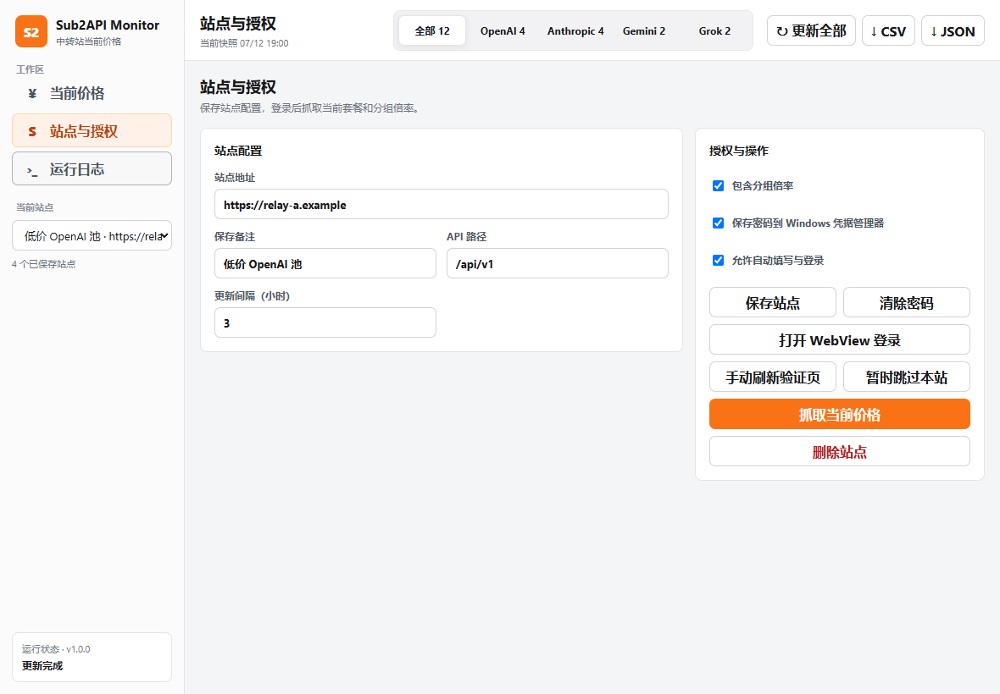
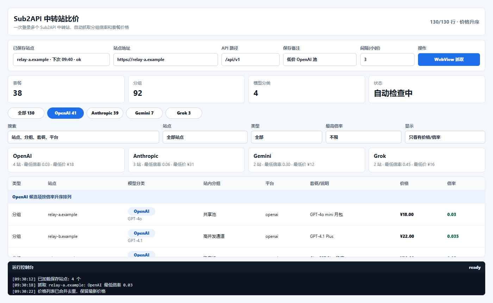
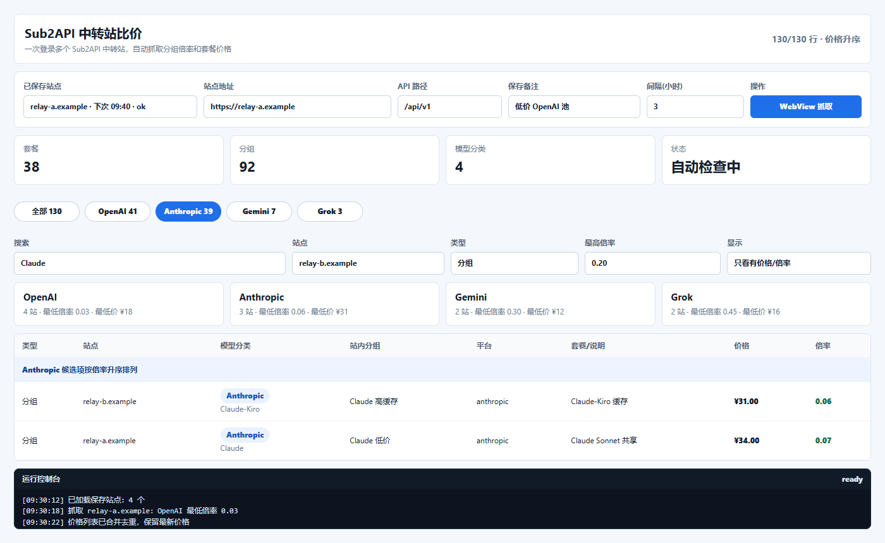

# Sub2API 中转站比价软件

这是一个面向 Sub2API 类中转站的桌面比价工具。你可以把多个中转站保存到软件里，使用内置 WebView 完成登录，然后自动拉取各站点的套餐价格、站内分组和倍率，集中按 `OpenAI`、`Anthropic`、`Gemini`、`Grok` 四类模型横向比较。

它适合用来回答一个很实际的问题：同一个模型分类下，当前哪个中转站、哪个分组的倍率最低。

## 主要能力

- 多站点保存：每个中转站可单独保存站点地址、API 路径、备注和检查间隔。
- WebView 登录：在软件内打开目标站点，手动完成登录或安全验证，后续复用本机 WebView 会话。
- 静默续期：接口返回 401/403 时先在同源 WebView 会话内尝试刷新令牌并重试一次，失败后才要求人工重新授权；令牌不会写入应用 JSON 或日志。
- 安全保存密码：按站点完整 URL 分开保存到当前 Windows 用户的凭据管理器，重新授权时自动填充。
- 自动比价：登录成功后自动抓取价格；每次打开软件也会自动检查已保存站点。
- 用户专属倍率：站点支持时会合并用户自己的分组倍率，列表同时保留基础倍率和用户倍率，并按实际生效倍率比较。
- 站点监控开关：每个站点可单独关闭启动和定时自动检查；手动“更新全部”和站点页 WebView 抓取仍然可用。
- 站点健康：汇总最近检查结果、连续失败次数、最后成功时间和下次检查时间，并保留最多 20 条精简检查历史。
- 连接测试：可在不写入快照、健康状态、变化记录或对比基线的前提下测试站点连接和授权。
- 分层状态：核心套餐抓取与用户倍率增强分别显示；增强接口临时失败会保留可用价格和最后可信倍率基线，同时将站点标为异常观察。
- 当前快照：每次更新都会重建对应站点的当前价格，只展示本次结果，不把历史行混入列表。
- 变化记录：独立记录倍率、价格、分组状态、专属属性、订阅类型、RPM、平台和抓取状态变化，并标注方向和严重程度。
- 未读状态：新变化会显示未读数量，可按站点、变化类型和关键词筛选，并支持全部标记已读。
- SMTP 通知：倍率、价格或站点状态发生变化时可发送分组摘要邮件；SMTP 密码按服务器、端口和账号绑定，只保存在当前 Windows 用户的凭据管理器中。
- 启动不卡顿：启动自动检查会进入后台任务，每次抓取 1 个站点，控制台仍可筛选、登录和查看结果。
- 关闭即退出：关闭主窗口会停止监控和通知、取消正在进行的检查、销毁所有辅助 WebView，并清理只属于本软件配置目录的 WebView2 残留进程。
- 防损坏写入：站点配置和最新价格使用原子写入，异常退出时不会留下半个 JSON 文件。
- 本地诊断日志：窗口版 EXE 的启动、退出和严重错误会写入轮转日志，便于排查且不会进入发行包。
- 重新授权检测：自动更新遇到登录态过期、401/403 或授权失效时，逐个打开对应站点的 WebView 重新登录。
- 失败原因诊断：区分登录失效、Cloudflare 验证、请求超时、HTTP 错误、接口响应不兼容和无价格数据。
- 分组排序：`全部` 页默认按价格升序，四个模型分页按倍率升序。
- 条件筛选：价格页支持搜索、站点、类型和最高倍率；站点页支持名称、健康状态和监控状态筛选。
- 隐私隔离：发行版不包含你的保存站点、登录状态、价格历史或 WebView 缓存。

## 快速使用

从 [Releases](https://github.com/ULing19/sub2api-price-monitor/releases) 下载 `Sub2APIPriceMonitor-*.exe` 后直接运行，不需要安装。

也可以在源码目录启动：

```powershell
.\tools\run_price_login_app.ps1
```

启动时带一个站点：

```powershell
.\tools\run_price_login_app.ps1 https://sub.example.com
```

## 图文讲解

### 1. 多站点总览



主界面采用左侧工作区导航，当前价格、站点管理、变化记录、SMTP 通知和运行日志各自独立。顶部可直接切换 `OpenAI`、`Anthropic`、`Gemini`、`Grok`，统计区展示当前快照中的套餐、分组和模型分类数量。`全部` 页按价格升序展示，模型分类页按倍率升序展示。

### 2. 价格变化与未读状态



`价格变化` 页面把倍率、价格、项目增删和信息变化单独列出，并在侧栏显示未读数量。可以按关键词、站点、变化类型和未读状态筛选；确认后可一次标记全部已读。截图只使用虚构的 `.example` 站点和示例价格。

### 3. 站点配置、WebView 登录和自动抓取



点击左侧当前站点旁的 `+`，或进入 `站点管理` 后点击 `新增站点`，填写网址、备注、API 路径、更新间隔、分组倍率和自动检查开关，再点击 `打开 WebView 登录`。你可以在站点窗口里正常登录、完成安全验证或进入控制台；软件不绕过验证，只复用已经登录成功的 WebView Cookie/session。登录态可用后，软件会自动调用 Sub2API 接口抓取当前价格，并把 WebView 窗口收起。

关闭 `自动检查此站点` 后，软件启动时的自动抓取和后台定时检查会跳过该站点，但不会禁用人工操作。你仍可在站点页执行 WebView 抓取，也可点击 `更新全部` 临时刷新包括已关闭自动检查在内的所有保存站点。

登录页只有一个明确的当前密码框时，软件会自动保存你填写的用户名和密码。再次打开同一站点登录页时会自动填充；站点开启 `自动登录`、提交按钮唯一且页面没有验证码、OTP 或未勾选的必选条款时，软件会自动提交。修改密码、注册确认等多个密码框页面不会自动填充，避免凭据混淆。

### 4. 模型分页按倍率找低价分组



进入 `OpenAI`、`Anthropic`、`Gemini` 或 `Grok` 分页后，软件会把不同中转站的站内分组摊平成候选项，并按倍率数值升序排列。表格里同时展示站点、模型分类、站内分组、平台、套餐说明、价格和倍率，用来快速定位当前最便宜的可用分组。

### 5. 条件筛选



当保存站点较多时，可以用筛选栏缩小范围。例如进入 `Anthropic` 页，搜索 `Claude`，类型选择 `分组`，并限制最高倍率不超过 `0.20`。筛选结果仍然保持倍率升序，适合快速比较 Claude、Gemini、Grok 等分类下的低倍率候选。

## 推荐流程

1. 输入中转站地址，例如 `https://sub.example.com`。
2. 根据目标站点调整 API 路径，默认是 `/api/v1`。
3. 点击 `打开 WebView 登录`，在弹出的站点窗口中完成登录。
4. 登录后等待自动抓取，或手动点击 `抓取当前价格`。
5. 填写或修改备注，点击 `保存站点`。
6. 对其他中转站重复以上步骤，然后在模型分页里比较倍率。

## 重新授权

自动更新全部站点或后台检查时，如果软件检测到某个站点返回 401/403、登录态过期、token/session 失效，或页面已经跳回登录界面，会把该站点标记为“需重新授权”。软件随后会逐个打开对应站点的 WebView，等待你重新登录；授权恢复并成功抓取价格后，窗口会自动收起，再继续处理下一个失效站点。

只有明确的 401/403、token/session 失效语义或页面已经回到登录表单时，软件才会进入重新授权流程。Cloudflare 验证、HTTP 5xx、网络超时、接口响应不兼容、未发现价格或登录窗口被手动关闭会保留为各自的失败原因，不会伪装成登录失效或反复弹窗。

如果目标站点停在 Cloudflare 安全验证页，软件会标记为 `Cloudflare 验证未完成` 并暂停自动抓取，保留当前 WebView 等待人工验证。请在 WebView 中手动完成验证，再点击 `WebView抓取` 继续；验证无法通过时，需要检查本机网络、防火墙或站点对 WebView 的兼容性。

## 登录密码

每个站点都可以分别开启 `保存密码` 和 `自动登录`。用户名和密码按完整站点 URL 独立保存到 Windows 凭据管理器，站点记录中只显示“已保存密码”，不会写入 `price-sites.json`、价格历史、WebView 缓存或发行版。跨域登录跳转不会自动填充原站点密码。

需要移除某个站点的密码时，先选择该站点，再点击 `清除密码`。取消 `保存密码` 并保存站点，或直接删除站点，也会同步删除该站点凭据。

自动登录失败后会进入冷却时间，不会每隔几秒反复提交旧密码。遇到 Cloudflare、人机验证、验证码、OTP、跨域登录或表单结构不明确时，软件只保留可确认的自动填充，等待你人工完成验证。

## SMTP 变化通知

在 `SMTP 通知` 中填写 SMTP 服务器、端口、发件人与收件人，并选择连接加密方式。保存后可以发送测试邮件；后续检测到倍率、价格、分组信息或站点状态变化时，软件会按上涨、下降、新增、移除、故障和恢复整理通知正文。

SMTP 主机、端口、账号和收件人等非秘密设置保存在本机 `notification-settings.json`，SMTP 密码只写入当前 Windows 用户的凭据管理器，不会写入 JSON、日志、EXE 或 GitHub 仓库。修改服务器、端口、加密方式或账号后必须重新输入匹配密码；清除密码会自动停用 SMTP 通知。

监控与邮件通知由正在运行的桌面程序执行，不是 Windows 服务。关闭主窗口或退出单文件 EXE 后，定时检查和邮件通知都会停止；下次启动后再恢复。

## 工作方式

软件会优先请求：

```text
/api/v1/groups/available
```

站点提供用户倍率接口时还会请求：

```text
/api/v1/groups/rates
```

用户倍率会覆盖对应分组的基础倍率，成为比较时使用的实际倍率；基础倍率和用户倍率仍会分别保留。接口返回 404/405 时视为站点不支持并继续使用基础倍率；临时网络或服务端错误会显示为增强数据降级，不会破坏最后可信倍率基线。

然后抓取套餐接口：

```text
/api/v1/payment/checkout-info
/api/v1/payment/plans
```

套餐会优先通过 `group_id`、`group_name`、`group_platform`、`platform`、`provider` 等字段匹配站内分组。模型分类会尽量根据分组信息归入 `OpenAI`、`Anthropic`、`Gemini`、`Grok`，匹配不到时才退回到套餐名称、描述或模型列表做弱匹配。

当前价格列表是最新快照，不是历史记录。每次更新会先移除本次刷新站点的旧行，再写入这次实际返回的套餐、分组或错误结果；已经消失的旧套餐和旧分组不会继续残留。后台只刷新到期站点时，未到期站点的当前快照会继续保留。历史快照仍单独写入 `price-history/`，不会重新混入当前列表。

`价格变化` 页面独立展示相邻成功抓取之间发现的倍率、价格、项目增删和信息变化，以及新的抓取失败状态。变化记录带有未读状态，新记录会计入侧栏数量；打开变化页后可按站点、类型、关键词或“只看未读”筛选，并可一次标记全部已读。软件为每个站点保留单独的变化对比基线，因此某次抓取失败不会把该站点原有项目误报为全部移除。

## 本地数据

源码运行时数据保存到：

```text
output/
```

单文件 exe 运行时数据保存到：

```text
%LOCALAPPDATA%/Sub2APIPriceMonitor
```

主要文件包括：

```text
price-sites.json
price-latest.json
price-latest.csv
price-changes.json
price-change-baselines.json
notification-settings.json
notification-logs.json
price-history/
price-webview-profile/
logs/app.log
```

`price-changes.json` 保存变化记录及其已读状态，`price-change-baselines.json` 保存各站点用于下次比较的本地基线，`notification-settings.json` 保存不含密码的 SMTP 设置，`notification-logs.json` 保存脱敏后的发送结果。这些文件都可能包含站点地址、价格或邮件地址，只保存在当前用户的数据目录中。

关闭主窗口后，软件会停止自动检查、邮件通知和未完成的抓取任务，然后关闭登录窗口与后台 WebView。它只会清理使用本软件专用 `price-webview-profile` 的 WebView2 进程，不会影响普通 Edge 或其他软件的 WebView。

诊断日志最多保留 4 个约 1 MB 的本地文件，并会隐藏 Bearer、Basic、常见密码参数、SMTP AUTH 和 `sk-` 密钥格式。日志、站点配置、Cookie、密码、价格变化、对比基线和价格历史都只保存在当前用户电脑上。

## 隐私边界

发行版只包含程序本体和抓取脚本，不会包含本机的 `output/`、保存站点、通知设置、价格变化、对比基线、价格历史或 WebView 登录缓存。其他人运行 exe 后会从空配置开始，自己的站点和登录状态会保存到自己的本机目录。

Windows 凭据管理器中的站点密码和 SMTP 密码属于当前 Windows 用户，也不会进入 exe 或 GitHub 仓库。

如果目标站点出现人机验证，请在 WebView 窗口中手动完成。这个软件不会绕过验证，也不会替你破解目标站点限制。

## 打包

生成单文件 exe：

```powershell
.\tools\packaging\build_price_app.ps1 -Version 1.2.1
```

产物位置：

```text
dist/price-webview-app/Sub2APIPriceMonitor-<版本>.exe
```
