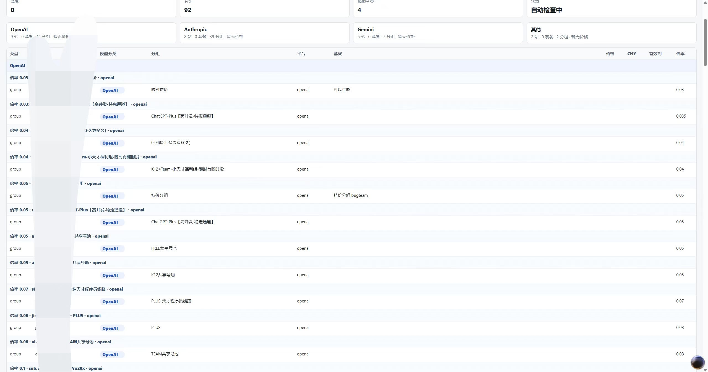
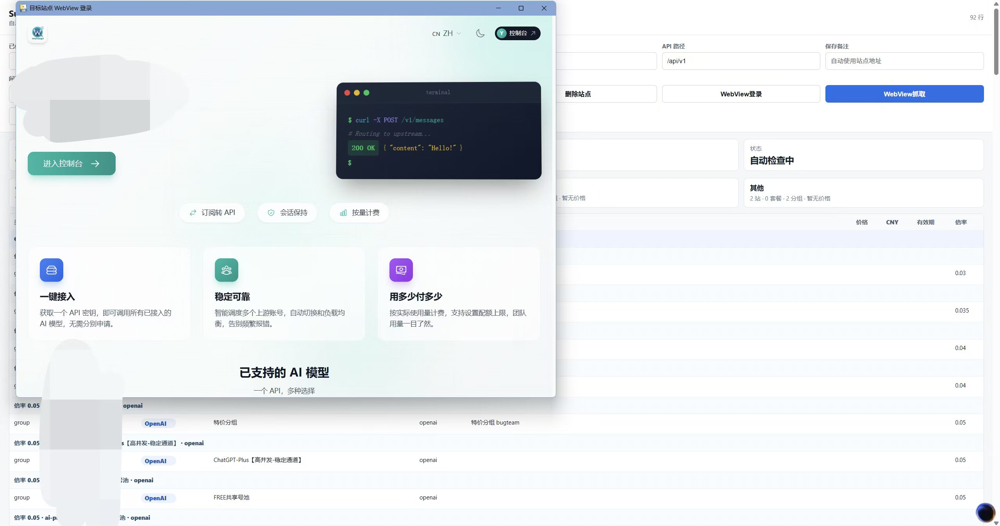
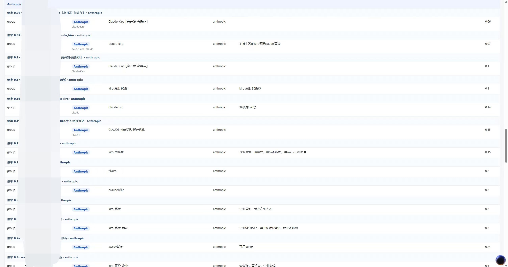
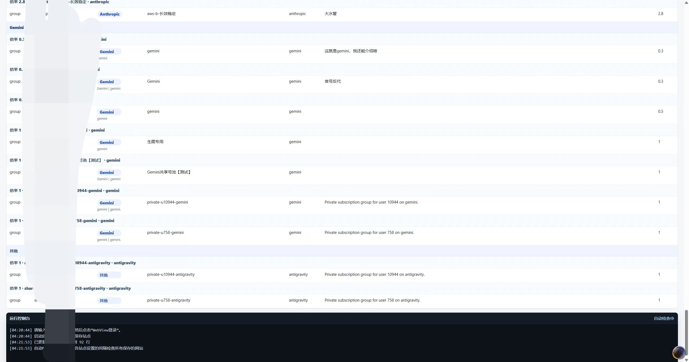

# Sub2API 价格拉取 WebView 应用

这个工具只走应用内 WebView：你在 WebView 窗口里登录目标站点，应用复用这个登录状态抓取价格、分组和模型分类。

目标站点不固定，只要是 sub2api 类似接口结构即可。默认 API 前缀是 `/api/v1`，可在应用里修改。

## 启动

在仓库根目录运行：

```powershell
.\tools\run_price_login_app.ps1
```

也可以启动时带一个站点：

```powershell
.\tools\run_price_login_app.ps1 https://example.com
```

首次运行如果缺少 `pywebview`，启动脚本会自动安装。

## 基本流程

1. 在控制台窗口输入 `站点地址`，例如 `https://sub.example.com`。`保存备注` 默认跟随站点地址，也可以手动编辑。
2. 点击 `WebView登录`，在目标站点 WebView 窗口里完成登录和安全验证。
3. 登录态可用后，应用会自动尝试抓取价格并收起 WebView 窗口；如果需要，也可以手动点击 `WebView抓取`。
4. 在 `全部` 或 `OpenAI`、`Anthropic`、`Gemini`、`Grok` 分页里查看比价结果，并用搜索、站点、类型、最高倍率等条件筛选。
5. 确认后导出 CSV 或 JSON。

## 配图演示









WebView 登录资料会保存在：

```text
源码运行：output/price-webview-profile
单文件 exe：%LOCALAPPDATA%/Sub2APIPriceMonitor/price-webview-profile
```

只要目标站点的登录状态没有失效，后续打开应用通常不需要重复登录。

## 多站点和自动检查

每个站点可以保存独立配置：

- 站点地址
- API 路径
- 更新间隔，默认 3 小时

保存备注默认使用站点地址，也可以编辑成自己好认的名字；保存列表里会显示下次更新时间。每次生成下次检查时间时，都会在站点间隔基础上加入 10% 以内的随机扰动，避免所有站点同时请求。

推荐流程：

1. 填写站点地址、API 路径和更新间隔。
2. 在 WebView 中完成该站点登录。
3. 点击 `保存站点`。
4. 对其他站点重复以上步骤。
5. 点击 `更新全部` 做一次即时比价。

每次打开应用后会自动对所有已保存站点抓取一次价格，并自动启动后台检查。你只需要为每个站点调整检查间隔。自动检查依赖应用保持打开；应用会逐个把已保存站点加载到同一个 WebView 里，再用当前持久化登录状态抓取。

每次抓取都会把新价格合并进当前价格列表，并按站点、类型、模型分类、分组、平台和套餐去重，保留最新抓到的价格。默认 `全部` 页按价格数值升序；`OpenAI`、`Anthropic`、`Gemini`、`Grok` 四个模型分页会把不同网站的不同站内分组摊平成候选项，并按倍率数值升序排序，用来快速找出当前倍率最低的站点和分组。

最新结果会写入：

```text
output/price-latest.json
output/price-latest.csv
```

历史快照会写入：

```text
output/price-history/prices-<时间>.json
```

站点配置会写入：

```text
源码运行：output/price-sites.json
单文件 exe：%LOCALAPPDATA%/Sub2APIPriceMonitor/price-sites.json
```

## 模型分类

抓取时会先请求：

```text
/api/v1/groups/available
```

然后再抓套餐接口：

```text
/api/v1/payment/checkout-info
/api/v1/payment/plans
```

套餐会优先通过 `group_id`、`group_name`、`group_platform`、`platform`、`provider` 等字段匹配分组。结果里的 `模型分类` 会优先根据匹配到的分组信息归入 `OpenAI`、`Anthropic`、`Gemini`、`Grok` 四个大类；不属于这四类的会归入 `其他`。

如果站点没有返回分组信息，应用才会退回到套餐名称、描述或模型列表做弱匹配。

## 安全验证

如果目标站点出现人机验证，请在 WebView 窗口中手动完成。工具不会绕过验证；它只复用你在 WebView 中已经完成的登录状态。

## 打包分发

生成单文件 exe：

```powershell
.\tools\packaging\build_price_app.ps1
```

产物位置：

```text
dist/price-webview-app/Sub2APIPriceMonitor-<版本>.exe
```

发行版不会包含本机的 `output/`、保存站点、价格历史或 WebView 登录缓存。其他人运行后会从空配置开始，自己的登录状态和保存站点会写到自己的 `%LOCALAPPDATA%/Sub2APIPriceMonitor`。
